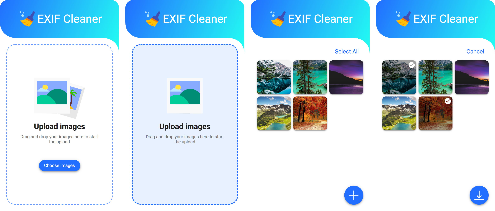

  

# EXIF Cleaner

A simple Progressive Web App for stripping off EXIF data from any image

## Key Features

- **Responsive:** fits to whatever size of screen it is, whether it is desktop, tablet or mobile device.

- **Connectivity Independent:** capable of working offline and slow internet networks

- **Safe:** all processing works are done completely on your device rather than in the cloud

- **Installable:** can "keep" application on your home screen without the bothering about an application store

- **Linkable:** effortlessly share by means of URL and not require complex installation

## Screenshots

## Design

https://www.figma.com/file/JK10Cy5EWCVNAA6cASZ4yP/EXIF-Cleaner?node-id=7%3A0
